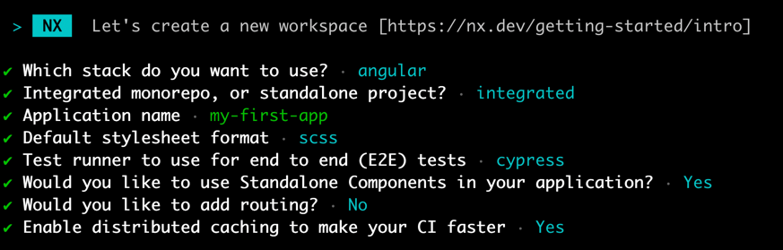

### Create a Nx Workspace

- Install the `nx CLI` with npm: `npm i --global nx`
- Create your workspace with following command `npx create-nx-workspace my-monorepo`
- Use this configuration:

* Start the application to verify everything is working

`nx serve my-first-app`
(short for: `nx run my-first-app:serve:development`)

- If you want you can test following executors:

- `nx lint my-first-app` (short for `nx run my-first-app:lint`)
- `nx test my-first-app` (short for `nx run my-first-app:test`)
- `nx build my-first-app` (short for `nx run my-first-app:build`)

## Solutions

You can find a [Repository on Github](https://github.com/martinakraus/my-monorepo) to follow along all tasks:
